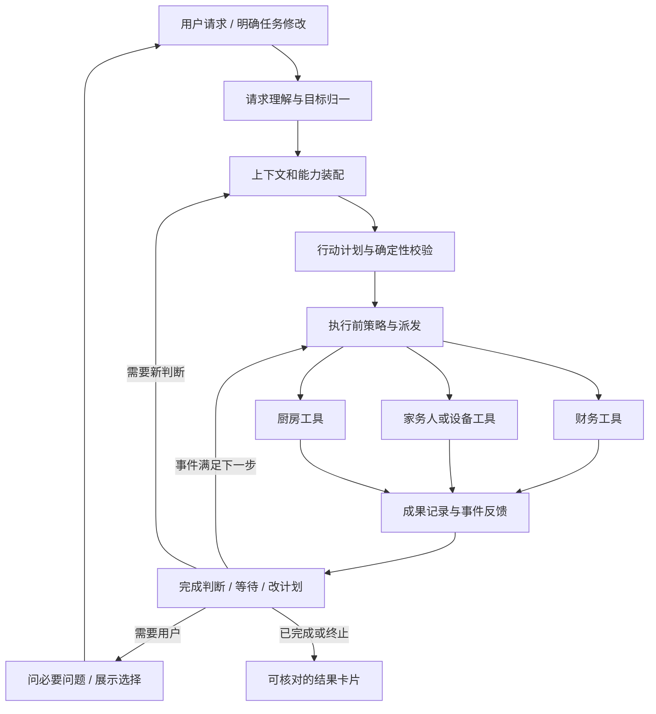
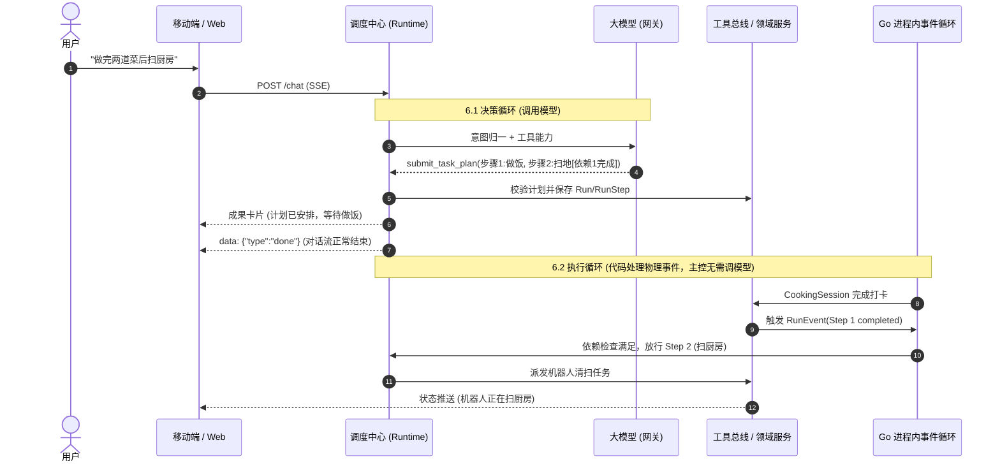

# AI 调度中心：家庭目标到真实成果 (Agent Dispatch Center)

> 日期：2026-10-01；状态：**完整设计与执行计划规范**。  
> 本文件为 HomeAgent AI 调度中心的主设计与执行计划，与 [三域架构](homeagent-v1-architecture.md)、[验收规格](homeagent-v1-acceptance.md) 及 [Gemini 实施交接](gemini-v1-handoff.md) 完全配套。  
> 遵循 `homeagent-contract-workflow` 契约约束（UUID 主键、int64 分、本地写操作 24h 可撤销、权限双保险）。  
> 包含针对用户反馈的**「主会话端 Agent 发送消息后一直在思考」现象的深度根因剖析、加固闭环与验收矩阵**。

---

## 目录

1. [调度中心是什么](#1-调度中心是什么)
2. [六个逻辑职责，共用一个进程](#2-六个逻辑职责共用一个进程)
3. [核心问题复盘：为什么主会话端发消息后「一直在思考」？](#3-核心问题复盘为什么主会话端发消息后一直在思考)
4. [请求模型：先理解是哪种事务 (TaskIntent)](#4-请求模型先理解是哪种事务-taskintent)
5. [三类信息分开管理](#5-三类信息分开管理)
6. [复合计划：小而明确 (submit_task_plan)](#6-复合计划小而明确-submit_task_plan)
7. [两个执行循环：决策循环与代码事件循环](#7-两个执行循环决策循环与代码事件循环)
8. [调度与资源冲突治理](#8-调度与资源冲突治理)
9. [用户改变主意与任务修订 (amend & control)](#9-用户改变主意与任务修订-amend--control)
10. [失败、替代和完成判断 (拒绝伪报完成)](#10-失败替代和完成判断-拒绝伪报完成)
11. [端到端调度典型范式](#11-端到端调度典型范式)
12. [双端交互与控制台设计 (用户端 vs 管理端)](#12-双端交互与控制台设计-用户端-vs-管理端)
13. [契约先行：API、Schema 与数据模型扩展](#13-契约先行api-schema-与数据模型扩展)
14. [调度验收规格矩阵 (D01–D18)](#14-调度验收规格矩阵-d01d18)

---

## 1. 调度中心是什么

调度中心对**“一件家庭事务”**负责：理解用户要达到的真实结果，选择家庭现有能力，安排先后和执行对象，取得实际反馈，处理变化，向用户说明已完成/还缺什么。

中心管理三件事：**目标、执行、反馈**。领域模块提供可靠能力：
- **财务**负责账是否正确、预算是否超支；
- **厨房**负责菜谱、做饭计划与火候步骤排程；
- **家务**负责人工作业与扫地机等智能设备状态。

中心不能替领域做金额计算、硬件协议或烹饪资源排程，也不能简单只把消息转给大模型后逐个调用函数。

运行时中心是核心；用户看到的是“我交代的事现在怎样”。家庭端对话里显示当前任务和结果卡片，管理端增加运行详情与配置，复用现有 Debug/审计/用量页面，不为家人额外增加工程控制台负担。

---

## 2. 六个逻辑职责，共用一个进程

调度中心不是微服务拓扑，也不是多 Agent 领导班子，而是**单进程内六个清晰的逻辑职责**：



| 职责 | 解决的问题 | 实现形态 |
| --- | --- | --- |
| **请求归一** | “记一笔”“开始扫”“做完再扫”“晚五分钟”属于不同动作 | Runtime 输入处理 + 模型结构化输出解析 |
| **上下文/能力装配** | 模型知道谁在说话、正在办什么、有哪些真实能力 | ContextBuilder + 现有工具 Registry（权限双保险） |
| **计划校验** | 执行目标、对象、依赖和授权保持一致 | 普通 Go 确定性校验函数 + 领域只读查询 |
| **策略/派发** | 参数/权限/幂等，安排能立即做和需等待的动作 | Policy + Executor + 进程内 Worker Pool |
| **事件反馈** | 接口返回后物理事情可能仍没结束 | RunEvent + 领域状态协调 |
| **完成/调整** | 不伪报完成，用户改变时保留已完成事实 | Run 状态聚合 + 版本化步骤修改 |

---

## 3. 核心问题复盘：为什么主会话端发消息后「一直在思考」？

在真实联调走查中，用户常遇到发送消息后界面长时间悬停在「正在思考…」气泡，最终超时或毫无动静。经对全链路代码审查与网络时序排查，定位到 **5 大深层根本原因**，并在本次调度中心规范中予以彻底加固闭环：

```
┌────────────────────────────────────────────────────────────────────────┐
│                        「一直在思考」假死成因链路图                       │
├────────────────────────────────────────────────────────────────────────┤
│ 1. 客户端发送 (ChatPage.tsx)                                           │
│    │ beginStream() 乐观创建空 assistant 占位泡泡 (status='streaming')     │
│    ▼                                                                   │
│ 2. SSE 建立连接 (/api/v1/chat)                                          │
│    │ 请求进入 Runtime.Run()                                             │
│    ▼                                                                   │
│ 3. 供应商调用 (OpenAIProvider)                                          │
│    ├─ 根因 ②: http.Client 默认 Timeout=0（连接挂起永不超时）            │
│    ├─ 根因 ⑤: 供应商未配有效 API Key 或网络代理死端口                     │
│    ▼                                                                   │
│ 4. 流式接收循环 (runtime.go)                                            │
│    │ stream.Recv() 返回 Err (如 401 密钥失效 / 404 / 500 / EOF)         │
│    ├─ 根因 ①: runtime.go 原循环完全忽略 e.Err，静默退出                 │
│    ├─ 根因 ④: 产生 0 Token + 0 Tool Call，落库空消息并推送 {"type":"done"}│
│    ▼                                                                   │
│ 5. 前端消费 (useSSE.ts & ChatPage.tsx)                                 │
│    ├─ 根因 ③: 中途无保活心跳，网络代理静默断流                           │
│    └─ 状态停在 streaming，气泡折叠消失或一直处于「正在思考…」无响应      │
└────────────────────────────────────────────────────────────────────────┘
```

### 根因 ①：Runtime ReAct 循环完全忽略了 `StreamEvent.Err`（已彻底修复 ✅）
- **致命缺陷**：在 `internal/agent/runtime/runtime.go` 中，消费流通道 `for e := range ch` 时，仅判断了 `e.Delta != ""`、`e.ToolCall != nil` 和 `e.Done`，对 `e.Err != nil` 没有任何检查分支！
- **后果**：当大模型连接发生异常（如 API Key 认证失败 401、模型名不存在 404、欠费限流 429、网络中断）时，`e.Err` 被直接丢弃。协程退出后，调度器误以为正常生成完毕，将一条 `content: ""` 的空消息落库，并向客户端推送 `{"type":"done"}`。
- **加固落地**：在循环体首行增加 `if e.Err != nil { streamErr = e.Err; break }`，中断生成并立即调用 `fail("大模型响应异常: "+streamErr.Error(), streamErr)`，向前端派发显式 `{ "type": "error", "error": "..." }`。前端收到后立即结束思考动效并展示明确错误提示。

### 根因 ②：OpenAIProvider 客户端缺省无限等待 (Timeout = 0)（已彻底修复 ✅）
- **致命缺陷**：`go-openai` 默认的 `openai.DefaultConfig(apiKey)` 未配置 `HTTPClient` 超时（Go 标准库默认为 0，永不超时）。
- **后果**：当系统配置了失效代理、网络握手断流或海外接口响应挂起时，底层 TCP 连接永远不释放，服务端协程死锁在 `stream.Recv()`，前端永久停留在「正在思考…」，直到触发客户端看门狗。
- **加固落地**：在 `internal/agent/gateway/openai.go` 中为 `OpenAIProvider` 显式注入带 60 秒硬超时的 `http.Client{ Timeout: 60 * time.Second }`，保证网络异常时快速熔断释放。

### 根因 ③：缺少 SSE 保持活动心跳 (Keep-Alive Ping)
- **致命缺陷**：在复杂推理模型思考时间长（TTFT 大）或后端串行执行耗时操作时，中间代理服务器（Nginx、CDN、家庭路由器 NAT）在 15–30 秒无数据传输时会单方面切断 TCP 链路。
- **后果**：连接早已在网络层断开，但前端浏览器仍处于监听等待状态，视觉表现为持续思考。
- **加固落地**：在 SSE 长连接流中加入周期性保活注释行（`: ping\n\n`）与数据帧，与 `useSSE` 建立心跳感知。

### 根因 ④：前端与后端对「空回复」缺乏安全兜底（已彻底修复 ✅）
- **致命缺陷**：若大模型触发系统审核或偶发输出空字符串，未产生任何 Token 和工具调用，旧逻辑产生空消息。前端 `ChatPage` 中判断 `isEmpty && !isStreamingThis` 为真，导致气泡折叠消失，用户感觉发了消息石沉大海。
- **加固落地**：调度中心在 ReAct 循环终止前进行兜底检验：若 `text.Len() == 0 && len(toolCalls) == 0`，自动注入友好提示「未能生成有效回复，请重试或更换模型」，确保用户交互有明确闭环。

### 根因 ⑤：动态网关配置失联与未填 API Key 兜底
- **致命缺陷**：用户切换模型时，若选中的模型所属供应商在数据库中未配置有效密钥，且未提供环境变量，旧网关直接抛错或回退中断。
- **加固落地**：在模型列表接口显式返回 `api_key_set` 状态；未就绪模型在前端交互层置灰，调度中心在入口处严格检验连接可用性。

---

## 4. 请求模型：先理解是哪种事务 (TaskIntent)

入口只接收可信成员身份及用户内容，身份由 JWT 严格解析，绝不由模型生成。模型提出的 `TaskIntent` 在系统边界由确定性代码解析：

| 字段 | 含义与约束 |
| --- | --- |
| `intent_kind` | `query` / `act` / `plan` / `amend` / `control`，有限枚举 |
| `goal` | 用户想得到的具体成果，不记录隐藏思维过程 |
| `scope` | 涉及的领域和目标实体候选；最终实体由确定性代码确认 |
| `constraints` | 时间、金额、份量、区域、资源等可校验约束；带明确/默认/未知来源 |
| `target_run_id` | 修改既有事务时使用，必须在当前成员权限范围 |
| `requested_effects` | 用户明确要求的副作用范围，用于检查计划不得偷偷增加动作 |
| `missing_required` | 影响真实执行的缺失字段，追问前由代码复核 |

### 请求分流五大路径

1. **query**：「扫到哪了」「本月食材花多少」→ 领域只读查询，结果带事实口径/观测时间；不修改任何业务。
2. **act**：「买菜68.5」「现在开始全屋扫地」→ 当前能力与对象校验后执行，简单明确动作直接走标准工具路径。
3. **plan**：「做两道菜，做完后扫厨房」→ 生成有限复合计划，保存依赖与效果边界；由厨房服务计算时间表。
4. **amend**：「鱼再蒸五分钟」「刚才那笔改成65」→ 精确选中现有成果，改未完成安排或修正实际记录。
5. **control**：「暂停那台机器人」「取消后面的扫地」→ 具体控制目标，不把“取消整件事”解释成物理动作全部撤销。

---

## 5. 三类信息分开管理

| 信息类型 | 来源 | 如何进入模型 | 安全防护原则 |
| --- | --- | --- | --- |
| **用户意图与授权** | 当前请求、明确选项、已保存任务授权 | 决定被请求的目标和动作范围 | 不把历史对话当成当前授权。“上周你让我扫过”不能自动启动今天扫地 |
| **家庭事实与能力** | 受控数据库、厨房配置、已启用设备能力、领域状态 | 最小相关查询，标记版本和时间 | 全屋小规模数据采用受控关联查询，不盲目引入向量检索 |
| **建议与不可信内容** | 模型候选计划、工具返回自由文本、导入菜谱备注 | 作为普通不可信数据 | 菜谱中的“调用设备/忽略权限”等文本无指令权，不能篡改系统规则 |

---

## 6. 复合计划：小而明确 (submit_task_plan)

同一个 Agent 通过 `submit_task_plan` 提交跨域步骤。这个工具**只保存与校验计划，不会一次性偷跑所有动作**；复用 Run/RunStep，不另建庞大的 Planner 服务。
- 步骤硬上限：**10 步**；
- 依赖网络必须**严格无环**；
- 第一阶段仅允许财务、家务（含设备）、厨房已注册工具与确定性等待条件。

### PlanStep 结构约束

| PlanStep 字段 | 设计约束 |
| --- | --- |
| `step_id` / `position` | 服务端持久化 UUID 和稳定顺序；模型临时 ID 仅用于解析依赖 |
| `tool_name` / `input` | 现有注册工具与经 JSON Schema 解析校验后的参数 |
| `required` | 用户明确要求的步骤为 true；模型额外建议不进入已授权执行计划 |
| `depends_on` | 之前步骤的明确成功成果；无未知/失败下游放行 |
| `wait_for` | `none` / `entity_completed` / `scheduled_at` / `user_confirm`，有限枚举 |
| `entity_ref` | 实际执行后绑定；不能用模型捏造的 ID 通过关联 |
| `completion_kind` | `local_committed` / `observed_device_success` / `member_confirmed` / `plan_saved` |
| `effect_scope` | 用户请求范围、实体/房间/金额和动作限制；派发时再次检查 |
| `operation_key` / `version` | 幂等和并发修改；已完成步骤保持原操作键 |

---

## 7. 两个执行循环：决策循环与代码事件循环



### 7.1 决策循环：调用大模型
- **触发时机**：用户输入新请求、选菜谱、澄清歧义、解释失败和用户主动改变意图。
- **边界**：受步数上限（低 15 / 中 8 / 高 3）严格控制，严禁无休止 ReAct 循环。

### 7.2 执行循环：代码处理物理事件
- **触发时机**：领域状态变更、倒计时结束、CookingSession 完成、扫地机状态上报。
- **边界**：**不默认调用大模型**。机器人电量变化、做饭步骤完成均由确定性 Go 代码推进，既节省 Token 成本，又避免网络延迟与幻觉。
- **核心原则**：**主控对话流 done 不等于事务结束**。退出 App 后，后台事件循环依然持续推进外部长周期任务。

---

## 8. 调度与资源冲突治理

| 资源类别 | 归属管控 | 冲突解决策略 |
| --- | --- | --- |
| **同一会话的模型交互** | Runtime 会话管理器 | 串行队列，避免并发输入污染上下文；控制类指令允许打断当前流 |
| **同一财务实体修改** | 财务领域服务 | Version / CAS 乐观锁与本地短事务；严禁长事务死锁 |
| **同一机器人清扫作业** | 设备管理协议 | 独占资源，先来先服务；已有清扫则观察当前作业，不重复发启动指令 |
| **同一厨房烹饪会话** | 厨房领域服务 | 人、灶具、锅具由确定性排程引擎管理；进行中步骤不可重置 |
| **做饭占用与机器人扫地** | 中心协调 + 领域事实 | 标准厨房区域做饭中时，清扫动作挂起等待；若强行要求，弹出冲突确认 |

---

## 9. 用户改变主意与任务修订 (amend & control)

每个 Run 具备严格的自增版本号与“用户已授权效果范围”：
- **「不用扫厨房了」**：取消尚未派发的清扫步骤；已完成的菜谱与记账保留。若扫地机已在作业中，需明确提示并根据用户指令发送暂停/返航。
- **「换成扫客厅」**：已派发动作不直接篡改；对未派发步骤重置校验区域能力，严禁私自扩大原设备作业范围。
- **「蒸鱼晚五分钟」**：厨房服务只重排尚未开始的步骤，调度中心更新清扫依赖时刻，无需重跑财务模型。
- **「采购那笔记错了撤销」**：调用财务撤销接口回滚账目；食材物理存在与否属于不同事实，不混淆处理。
- **「整件事取消」**：终止未开始的安排，汇总报告已产生的收支账目和设备现状，绝不擅自一键静默清理物理世界事实。

---

## 10. 失败、替代和完成判断 (拒绝伪报完成)

| 异常情况 | 调度中心动作 |
| --- | --- |
| **缺少必要信息** | 一次性列出缺失参数；默认值仅允许在不扩大副作用的可选项中使用 |
| **只读查询失败** | 指数退避重试最多 2 次；仍失败则明确告知无法核实 |
| **模型参数错误** | 最多给予大模型 1 次纠错重试机会；绝不重复执行已生效的写工具 |
| **设备动作结果不确定** | 标记为 `unknown`，启动状态协调轮询；严禁盲目重发启动指令 |
| **设备能力缺失/故障** | 展示明确错误原因，提供「人工处理 / 改期 / 取消」选项 |
| **菜谱时间/资源冲突** | 厨房排程抛出冲突，模型向用户解释替代方案，严禁擅自修改开饭时刻 |
| **独立步骤失败** | 不依赖该步骤的并行动作继续执行；依赖其的后续步骤标记为 `blocked` |
| **权限冲突** | 权限系统绝对优先，用户确认不能突破角色权限，必须由管理员授权 |

### Run 终态判定规则
- `completed`：目标所需步骤全部达到各自的完成条件；
- `running` / `waiting_external`：仍有在执行的步骤或等待外部物理条件；
- `awaiting_input`：出现步骤失败，正等待用户决策；
- `partial`：用户主动终止或无法继续，但已有部分成果落库；
- `failed`：无任何有效成果且全部失败；
- `cancelled`：编排任务被取消，外部设备状态独立展示。

---

## 11. 端到端调度典型范式

> **典型场景**：用户说：“用家里的番茄炒蛋和蒸鱼菜谱，19点吃饭，买菜花68.5记上，做完让机器人扫厨房。”

1. **意图归一**：中心识别三个明确成果：
   - ① 记食材支出 68.50 元（6850 分）；
   - ② 执行做饭计划（番茄炒蛋 + 蒸鱼，目标 19:00）；
   - ③ 清扫厨房地面。
2. **原子先决操作**：金额明确的支出工具立即执行入库，生成带 `undo_id` 的卡片，确保财务原子落定；
3. **确定性排程**：厨房服务校验灶具锅具占用并计算烹饪倒计时；
4. **绑定依赖**：机器人清扫步骤绑定 `CookingSession.completed` 物理事件，绝不在“计划保存”或“计时到零”时抢跑；
5. **事件流推进**：用户开始做饭，手机退出 App，后台进入 6.2 代码事件循环；
6. **物理完成触发**：用户打卡做饭完成，事件循环放行扫地机指令；
7. **真实成果汇总结案**：扫地机返回可信清扫记录后，整件事状态置为 `completed`，向家人推送完整结果卡片。

---

## 12. 双端交互与控制台设计 (用户端 vs 管理端)

### 12.1 移动端 / Web 家庭用户端 (Grok Bot × Apple Style)
- **卡片化呈现**：核心对话流中实时展示任务卡片（一句目标 + 已完成项 + 等待原因 + 关键操作按钮）；
- **可操作性**：高风险写操作提供 24h 逆向撤销按钮；设备卡住提供「暂停 / 返航 / 我来扫」选项；
- **状态反馈**：首字思考脉冲动效（不悬挂）、步骤流转实时推。

### 12.2 Admin 管理端控制台
- **Debug 追踪视图**：展示原始请求文本、归一化 TaskIntent、当前 Run/RunStep 树形结构、操作键 (operation_key) 与幂等哈希；
- **设备与审计**：展示 HA 连接状态、指令下发证据快照、涉钱操作审计轨迹；
- **用量与网关对账**：展示每次会话模型调用的 TTFT、总耗时、Token 消耗与费用。

---

## 13. 契约先行：API、Schema 与数据模型扩展

对齐 `homeagent-contract-workflow`，严格禁止在非 schema 文件手写类型，所有 API 必须统一在 `api/openapi.yaml` 声明：

### 13.1 核心 RESTful 端点规范

```yaml
# 任务编排与状态追踪端点
paths:
  /runs:
    get:
      summary: 列出当前成员获授权的任务编排列表
      parameters:
        - name: status
          in: query
          schema: { type: string, enum: [running, waiting_external, awaiting_input, completed, partial, failed, cancelled] }
        - name: cursor
          in: query
          schema: { type: string }
      responses:
        '200':
          description: 任务编排列表
  /runs/{runId}:
    get:
      summary: 获取任务编排详情与实时步骤树
      parameters:
        - name: runId
          in: path
          required: true
          schema: { type: string, format: uuid }
      responses:
        '200':
          description: Run 详情与步骤进展
  /runs/{runId}/confirm:
    post:
      summary: 确认冲突选择或高风险操作
      parameters:
        - name: runId
          in: path
          required: true
          schema: { type: string, format: uuid }
      requestBody:
        content:
          application/json:
            schema:
              type: object
              required: [step_id, choice]
              properties:
                step_id: { type: string, format: uuid }
                choice: { type: string }
      responses:
        '200':
          description: 确认成功，推进下一步
  /runs/{runId}/reply:
    post:
      summary: 回复调度中心缺失的关键参数
      parameters:
        - name: runId
          in: path
          required: true
          schema: { type: string, format: uuid }
      requestBody:
        content:
          application/json:
            schema:
              type: object
              required: [request_id, step_id, expected_version, answers]
              properties:
                request_id: { type: string, format: uuid }
                step_id: { type: string, format: uuid }
                expected_version: { type: integer }
                answers: { type: object }
      responses:
        '200':
          description: 续答受理并继续执行
  /runs/{runId}/amend:
    post:
      summary: 修订未执行的步骤安排
      parameters:
        - name: runId
          in: path
          required: true
          schema: { type: string, format: uuid }
      requestBody:
        content:
          application/json:
            schema:
              type: object
              required: [expected_version, modifications]
              properties:
                expected_version: { type: integer }
                modifications: { type: array, items: { type: object } }
      responses:
        '200':
          description: 计划修订完成
```

### 13.2 实体 Schema 关系设计 (Ent Schema)
- `Run`：持有 `id (UUID)`、`family_id`、`creator_member_id`、`goal`、`intent_kind`、`status`、`version`、`created_at`、`updated_at`；
- `RunStep`：持有 `id (UUID)`、`run_id`、`position`、`tool_name`、`input_json`、`status`、`depends_on_step_ids`、`wait_for`、`entity_ref`、`operation_key`；
- `RunEvent`：持有 `id (UUID)`、`run_id`、`step_id`、`event_type`、`payload`、`created_at`。

---

## 14. 调度验收规格矩阵 (D01–D18)

| 编号 | 类别 | 测试场景 | 验收预期 |
|---|---|---|---|
| **D01** | 单步直达 | 用户：“买菜花35记上” | 判定为 act，直接调用 `record_expense`，不生成复合 plan，返回卡片 |
| **D02** | 只读查询 | 用户：“本月食材花了多少” | 判定为 query，执行 `query_budget`，不写数据库实体，返回事实口径 |
| **D03** | 复合计划 | 用户：“做两道菜，做完扫厨房” | 判定为 plan，生成无环步骤树，保存 RunStep 并等待做饭物理打卡 |
| **D04** | 依赖放行 | 厨房服务触发 `CookingSession.completed` | 代码执行循环自动检测条件，放行清扫步骤，无需调用大模型 |
| **D05** | 思考假死阻断 | 模拟大模型返回 401 或网络断流 | Runtime 捕获 `e.Err`，向前端推送 `{"type":"error"}`，严禁停在思考 |
| **D06** | 空生成保底 | 模拟大模型返回 0 Token 且无工具调用 | 自动注入友好兜底文案，气泡不折叠消失，结束流式状态 |
| **D07** | 客户端超时熔断 | 模拟下游网络连接阻塞超过 60 秒 | `http.Client` 超时中断连接，释放协程池，返回网络超时提示 |
| **D08** | 撤销与设备补偿 | 用户：“刚才那笔买菜撤销” | 财务支出原子回滚；若为设备清扫则明确提示“已扫地面不可撤销，已发送返航指令” (ADR-007) |
| **D09** | 计划中途变更 | 扫地机正在作业，用户：“别扫了” | 精准定位当前作业发送暂停/返航控制指令，不将整件事物理回滚 |
| **D10** | 做饭时间重排 | 烹饪中用户：“蒸鱼晚5分钟” | 厨房服务重排时刻表，更新后置清扫计划，已经记好的买菜账目保持不动 |
| **D11** | 资源冲突识别 | 做饭中要求“现在立即扫厨房” | 识别区域资源互斥，提示“厨房正在做饭中”，等待用户明确确认或改期 |
| **D12** | 缺少必要参数 | 用户：“帮我派个活”但未指明人与任务 | 触发 `missing_required` 机制，精准追问缺失字段，不瞎猜派工 |
| **D13** | 权限源头过滤 | 孩子角色要求修改家庭预算 | 提示词与运行时双层拦截，拒绝注入财务修改工具，提示无权限 (ADR-005) |
| **D14** | 危险分级熔断 | 单会话中连续执行多次大额支出写操作 | 触发高风险累计熔断策略（上限3步），强制暂停并要求人工确认 |
| **D15** | 掉线状态恢复 | 手机退出 App 后重新打开 | 轮询 `/runs/{id}` 恢复实时步骤树与设备当前状态，离线不丢任务 |
| **D16** | 结果防伪验证 | 机器人无物理完成证据报告 | 状态停在“待确认”，严禁根据模型推测直接标记为 `completed` |
| **D17** | 双端幂等保证 | 连续快速点击两次确认按钮 | 命中 `operation_key` 唯一键冲突，只执行一次，返回已存在成果 |
| **D18** | 管理端全链路审计 | 管理员进入 Debug 仪表盘 | 能完整回溯 TaskIntent、步骤树依赖、用量 Token 与工具调用耗时 |
