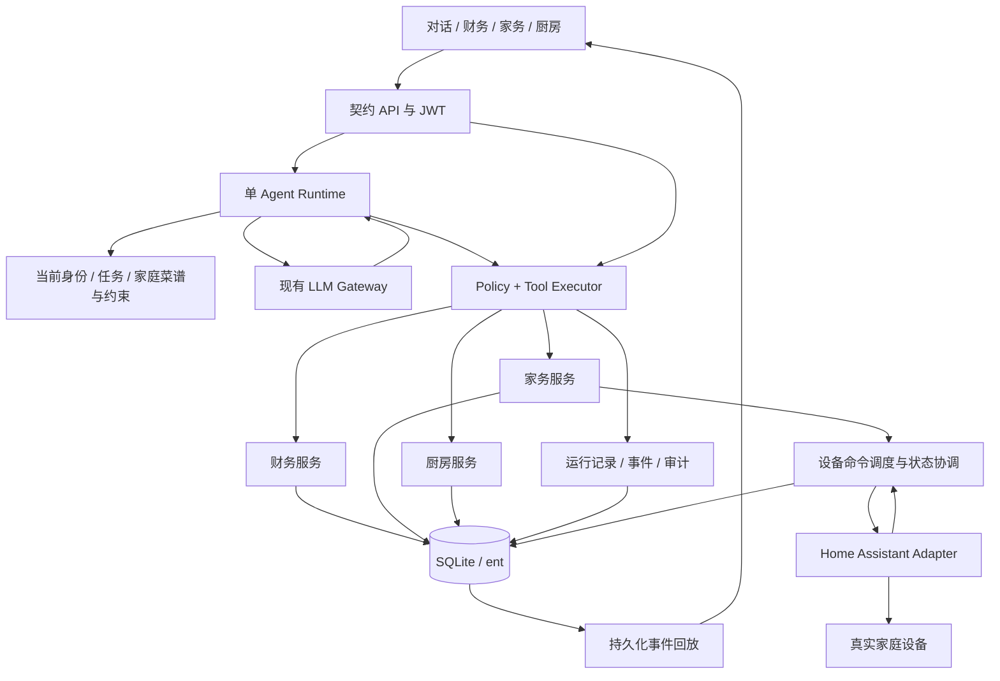

# HomeAgent 第一步架构设计：财务、家务、厨房

> 版本：1.0；日期：2026-10-01；状态：设计交付，未实现。用户方向优先于旧 PRD：第一步聚焦财务 + 家务 + 厨房，交付实际事务能力；不以报饭、积分或泛化提醒作为核心。实现交给 Gemini。本文件是本轮设计的唯一架构入口；验收见 [验收规格](homeagent-v1-acceptance.md)，交接见 [Gemini 实施说明](gemini-v1-handoff.md)。

> 核心主控详设：[AI 调度中心](agent-dispatch-center.md)。明确请求分流、有限复合计划、模型决策循环/代码执行循环、等待条件、资源冲突、任务修订与目标完成判断。中心职责由现有Runtime与少量确定性组件承载，领域模块作为其能力。

## 1. 产品交付边界

做一个家人可直接使用的家庭执行助手：钱能记清、查清和改对；家务能安排人或设备并看实际结果；厨房有自己的菜谱，能带着人做饭并协调几道菜的时间。AI 是统一入口；账本、家务与厨房页面是同一领域状态的可查看、可操作视图。

| 第一阶段必须交付 | 具体成果 |
| --- | --- |
| 财务 | 自然语言/手动收支记录、修正、撤销、合并流水、分类汇总、家庭授权视图、预算；固定账单生成待办，不虚构已付款 |
| 家务 | 人工任务与设备任务；个人 HA 接入、选择可用设备、扫地机动作与状态反馈；失败/卡住能处理，未证实完成就不标完成 |
| 厨房 | 家庭菜谱持久化和搜索、步骤指导、份量换算、食材准备清单；多菜时间协调、多人分工、计时与中途重排 |
| AI 核心 | 清楚识别意图和约束、调用可信工具、显示真实结果、断线后可查、拒绝伪成功、遇歧义只问必要问题 |

设备不是所有家庭都已具备的前提：软件底座与模拟适配器可以无硬件验收；“真实设备接入完成”必须有用户实际型号的实机证据。用户未提供品牌型号时，不能把模拟通过写成扫地机已接入。

第一阶段不依赖银行接口、支付平台商户资质、外卖/买菜平台商业 API、厂商企业 IoT 开放平台、学校/医院内部接口。采购清单在应用内完成，买菜手动记实际支出。硬件配对使用设备个人账号或本地配对；普通个人账号也不保证所有型号兼容。

## 2. 三个真实使用闭环

### 2.1 财务：把家庭账管清楚

「今天买菜 86.5，停车 12，工资到账 9000」→ 解析三笔独立记录 → 金额确定时分别落库 → 卡片显示金额/类型/分类/日期 → 财务页立即可查 →「买菜改成 68.5」精确定位记录并修正 → 修改可撤销。

「这个月还能用多少」→ 读取获授权账本、预算、实际收支和未支付固定账单 → 给出“预算剩余”和“预计待支出”，分别计算。没有账户余额数据时不得称为现金余额。收入减支出只是本月净收支。

### 2.2 家务：让设备真干活、让家人知道结果

「把客厅扫一下」→ 识别客厅与绑定扫地机 → 读取实时能力和状态 → 型号支持区域清扫则只扫客厅 → 保存命令 → 发出动作 → 卡片显示“已请求/执行中” → 持续观察 → 有完成记录才显示完成；卡住时显示故障与处理入口。

不支持区域清扫时必须说明“该设备只能全屋清扫”，用户选择全屋或取消；不暗中扩大范围。若有多个机器人匹配，先选设备。房间地面整理交给人，清扫交给机器，任务只有相应执行证据才能完成。

### 2.3 厨房：带着人把菜做出来

「做家里的番茄炒蛋和蒸鱼，19 点开饭，我只有一个灶，你帮我安排」→ 查家庭菜谱 → 核对份量/食材/工具 → 生成可编辑计划 → 指出需要炒锅和蒸锅且共用一个灶 → 排出真实可执行顺序 → 操作时突出当前步骤、火候提示与计时 → 蒸鱼晚了 5 分钟就重算剩余时间，说明是否还能 19 点吃上。

菜谱有记录才称“家里的做法”。AI 临时生成的做法标记为草案，用户保存后成为家庭菜谱。设备控制与做饭指导分离；第一阶段不自动点火、远程启动加热或将智能插座当灶具控制器。

## 3. 接入可行性：个人可部署

### 3.1 选择 Home Assistant 作为设备桥接

HomeAgent 不逐一实现厂商私有协议。家庭先让设备在 Home Assistant（HA）里工作，HomeAgent 只接 HA 的状态与动作接口。第一阶段只有 `HomeAssistantAdapter` 和 `FakeDeviceAdapter` 两种适配；直接 MQTT、Matter 控制器、品牌原生 API 延后，不为扩展预建插件市场。

| 项目 | 本轮核实的官方依据 | 设计结论 |
| --- | --- | --- |
| HA 本地访问 | 用户可在自己 HA 的个人资料中创建长效令牌，通过 Bearer 调用 REST [官方 REST 文档](https://developers.home-assistant.io/docs/api/rest/) | 由家庭管理员配置 URL 和令牌；不用厂商开发者资质 |
| 状态推送 | WebSocket 支持订阅 `state_changed` [官方 WebSocket 文档](https://developers.home-assistant.io/docs/api/websocket/) | 订阅 HA 的变化；下游硬件仍可能轮询，不能称毫秒级物理实时 |
| 扫地机动作 | HA 提供启动、暂停、返航等动作 [官方 vacuum 文档](https://www.home-assistant.io/integrations/vacuum/) | 实际使用必须检查当前实体支持能力；通用动作列表不等于所有机器都支持 |
| 石头机器人示例 | 集成使用普通 Roborock App 账号；多数机器人本地通信与云初始化/回退混合，地图依赖云 [官方 Roborock 集成](https://www.home-assistant.io/integrations/roborock/) | 可作为候选，不能承诺纯离线或指定型号必兼容；房间映射与完成证据另验 |
| 普通智能设备示例 | Shelly 集成直接与设备通信，不要求云连接 [官方 Shelly 集成](https://www.home-assistant.io/integrations/shelly/) | 说明个人本地控制路径确实存在；不要求用户购买该品牌 |
| HomeKit 设备示例 | 接入需要配对码，同一设备配对状态有约束 [官方 HomeKit Device 集成](https://www.home-assistant.io/integrations/homekit_controller/) | 仅在已有设备适用时选择，迁移配对由用户自己操作 |

上表是方案可行性证据，截至 2026-10-01；不是采购推荐或具体硬件认证。Gemini 必须在设备确定后复核当前版本、区域、固件和支持实体。

### 3.2 最小部署

```text
家中手机/电脑浏览器
        │ LAN + HomeAgent JWT
        ▼
HomeAgent：Go API + React/PWA + SQLite + 进程内持久化任务扫描
        ├── LLM 网关（沿用现有兼容供应商）
        └── 本地网络 HTTP/WebSocket ── HA ── 已接入家电
```

HomeAgent 后端与 HA 必须网络可达，手机在同一家庭网络即可使用；后端部署于家中常开电脑/NAS/小主机。HA 的安装路径由用户现有环境选择，软件设计不要求购入专用硬件。若 HomeAgent 继续部署云 VPS，不能默认访问家中私网；远程安全连通不属于第一阶段完成条件。

用户只配置 HA 地址、个人访问令牌和设备映射。令牌仅后端加密存储、只回显掩码，不进入前端运行上下文/LLM/日志。HA 令牌不能被当作天然的设备级权限；HomeAgent 自己落实成员权限与设备/动作白名单。配置 URL 是管理员操作，拒绝模型指定 URL/任意跳转；只访问已配置 HA origin。

没有 HA 时提供配置说明和人工家务，不展示虚构设备。模拟设备只出现于显式开发/测试模式，页面带“模拟设备”标签。

## 4. 总体软件架构



保持 Go/Gin/ent/SQLite + React + OpenAPI。依赖为 `api/v1 → agent/domain → store`；store 实现上层声明的接口。设备适配器放 `internal/infra/homeassistant`，实现 `domain/chore` 声明的 DeviceProvider。复用现有 task 服务承载人工家务，可在内部演进为 chore 门面，不一次性重命名全仓库。

**只增加必要组件**：ContextBuilder、执行前 Policy、持久化 Run、设备 Provider、命令调度与状态协调、厨房时间排程。Policy 起步为 Go 规则函数，不引入策略 DSL。工具总量仍小，权限内稳定排序全量注入即可；不上向量库、长期聊天记忆、通用规划框架、多 Agent、消息中间件或可编程自动化平台。

## 5. AI 驾驭工程

### 5.1 职责边界

| 模型负责 | 可信代码负责 |
| --- | --- |
| 理解自然语言、识别缺失约束、提出工具调用 | 金额转换/校验、身份权限、精确实体解析、幂等和持久化 |
| 提出菜单、解释步骤、生成候选菜谱 | 菜谱结构校验、版本保存、份量换算规则和已知忌口过滤 |
| 建议家务与做饭分工、解释计划 | 设备能力检查、命令状态、资源冲突检测和排程 |
| 根据结构化结果总结 | 未拿到成果不能宣称成功，设备未完成不能提前打卡 |

模型看不到 HA 凭据，不接收“任意 domain/service/JSON”的设备控制工具。模型输出的设备名、菜谱名、账单定位由代码匹配候选；重名不随意选择。

### 5.2 上下文

每轮只装配：真实成员/角色、家庭时区、当前请求和关联 Run、权限内工具、与任务相关菜谱/厨房资源/设备快照、最近完整对话对。家中设备清单很小，用数据库查询即可。菜谱搜索先标题/标签/食材查询，不依赖向量检索。

已确认忌口、厨房灶眼数量、常用锅具是显式家庭配置；记录来源和更新时间。硬约束如忌口必须由代码检查；菜谱食材信息不完整时标记“无法核实”，不声称绝对满足。做饭人数来自本次输入或可见默认份量，不要求家人报饭。不确定的库存写“未确认”，没有库存系统就不假装知道冰箱里有什么。

### 5.3 工具执行协议

`Spec` 扩展字段：`operation(read/local_write/device_command)`、`permission`、`input_schema`、`output_schema`、`risk`、`timeout`、`retry_policy`、`version`。不再靠风险等级判断是否写操作。所有工具结果统一返回 `status/summary/data/entity_refs/effect/recovery/trace_id`；`recovery` 明确 `undo/cancel/compensate/none`。

调用顺序：当前权限与设备授权 → 参数与归属 → 调用额度/时限 → 必要确认 → 操作键 → 领域执行 → 持久化成果 → 发事件。写工具和页面快捷操作共享同一应用命令入口，防止绕过幂等、撤销与审计。

默认配置起点：每次请求最多 8 次模型调用、20 次工具调用、10 个本地写动作、120 秒同步运行；累计输入输出 token 上限 24000，单次输出上限 2000。模型 token 估算器不可用时用保守估计；成本仅在配置有效价格时约束，未配置显示未知。设备长时间运行和做饭计时不占用模型循环，不持续调用 LLM。数值经验收调优，业务循环里不得硬编码。

风险使用显式映射 `low=0/medium=1/high=2`。一次模型输出多个调用，执行器逐个检查并即时停止；后续未执行项也回传工具结果，保证 tool_call/result 协议完整。流错误、权限加载失败、必要持久化失败不得发成功终态。

### 5.4 确认策略

明确金额的个人历史收支记录、存菜谱、人工家务创建是普通可逆写，默认直接执行并给修正/撤销。金额含糊、候选记录不唯一、批量修改或预算规则改变时先预览；孩子的财务写权限按家长配置，不以提示词代替校验。财务记录与真实支付分开，第一步无支付动作。

设备由管理员先绑定实体并授权动作。成员明确要求启动已授权扫地机时直接执行，不重复询问；范围不能满足、设备归属不清、需要扩大范围时追问。定时设备任务在创建时明确授权作用对象、动作与时间，执行时复验；不生成“全家离开就扫地”等没有真实触发源的推测自动化。

### 5.5 运行记录和恢复

新增最小 Run/RunStep/RunEvent，目的只为保存工具执行和成果，不构建通用 DAG 引擎。Run 状态：`running/awaiting_input/awaiting_confirmation/waiting_external/completed/partial/failed/cancelled`。RunStep 状态：`pending/executing/committed/waiting_external/failed/unknown/skipped`。

`POST /chat` 保持可用并增加 `request_id`。新入口先发 run_id/conversation_id，随后兼容原 token/tool_call/done/error；新增事件由 OpenAPI 定义。前端结束连接后可通过 Run API 获取状态和按 seq 重放事件。`done` 只结束本次对话流，Run 可以继续 waiting_external。机器人运行由后台协调器更新，不把聊天连接挂几十分钟。

必要确认存到 RunStep：confirmation_nonce、输入摘要、expected_version、expires_at、consumed_at；不建独立审批平台。默认有效期10分钟，确认时复验输入/权限/版本，一次消费；参数修改必须重新预览。取消 Run 默认仅停止未开始步骤，已运行设备持续可查；用户明确暂停/返航才发对应动作。取消编排不意味着设备已停，界面必须分别呈现。

每个写动作有独立 operation_key。同一次网络重试返回原成果；两次真实同额消费使用两个 request_id，不能合并。用户新说“再记一笔”是新动作；同一请求键带不同 payload 返回 conflict。

本地业务数据、undo_log、必要审计、RunStep 成果和公开事件同事务；数据库故障全部回滚。通过 UnitOfWork Provider 使领域仓储实际使用事务客户端。流发送失败不回滚已提交业务，客户端恢复时重放。撤销检查版本和后续引用，冲突时不覆盖他人更新。

## 6. 财务设计

### 6.1 功能与规则

- 收支 CRUD 复用现有模型/API；金额只收 `amount_cents:int64`，元字符串由边界十进制解析转分，禁止 float 中转。
- 时间缺省为家庭时区当日，可补记；存储带时区的时间点，统计按家庭本地月份边界，不按 UTC 截断。
- 分类是确定性代码/显式选择。无法确定可记“未分类”，卡片可修正；不为低价值分类重复提问。
- 合并流水按发生时间与 ID 稳定游标排序，支持类型/分类/时间范围/记录人过滤，净收支不包含软删记录。
- 财务共享由权限决定：可查看自己的记录；家庭汇总仅给 `finance.household.read` 成员，查他人明细另需 `finance.household.details`。缺权限时标题明确“我的收支”，不得伪装家庭全量。
- 分类预算返回预算额/实际支出/余额；未配置预算返回未设置。预算不等于银行账户余额，不做投资建议。
- 固定账单：月/年固定日期、金额、名称；短月取月底。每期生成“待处理”BillOccurrence，用户点击已支付时才创建实际支出；唯一约束 `rule_id+period_key`。
- 固定账单撤销：创建规则可撤销并取消未处理实例；已支付账单撤销恢复待处理并撤销关联支出，冲突显式处理；不影响其他期已支付事实。

### 6.2 工具与 API 草案

| 工具 | 主要输入 | 输出 | 恢复 |
| --- | --- | --- | --- |
| `record_expense/record_income` | 分金额、内容、日期 | 记录 ID、分类、版本、undo_id | undo |
| `query_finance` | scope、range、filters、view(ledger/summary/budget/bills) | 获授权流水或汇总，统计口径 | 无 |
| `update_finance_record` | 类型、记录 ID、expected_version、修改 | 前后值和新版本 | undo |
| `set_budget` | 分类、月预算分 | 旧/新预算 | undo |
| `manage_recurring_bill` | create/update/archive、规则字段、expected_version | 规则与待处理实例 | undo |
| `mark_bill_paid` | occurrence_id、实际分金额、expected_version | 账单状态与关联支出 | undo |

现有隐藏 update 工具可保留内部派发，公开修正入口按上述协议统一。新增 API 建议 `/finance/ledger`、`/finance/budgets`、`/finance/recurring-bills`、`/finance/bill-occurrences/{id}/paid`；补齐规则详情修改和待办列表。已有 `/finance/summary`、expenses/incomes API 复用，不建第二份账本。

## 7. 家务与智能设备设计

### 7.1 家务是执行对象，不是积分列表

扩展现有 Task：`executor_type=human/device`、负责人或 device_id、当前动作状态、RunStep 引用。人工完成来源为 member_confirmation；设备完成来源为可核实观察，不允许用人工打卡接口直接完成正在执行的设备任务。人机混合任务按子任务呈现，不把扫完地等同整个厨房收尾完成。

人工任务支持创建、指派、改期、取消、完成与撤销。同一人不能凭提示词替其他人打卡；允许代办时需明确权限。创建人工任务与依赖的设备任务只保存实际请求，不自动生成多余家務。

### 7.2 最小设备能力模型

管理员从 HA 中选择实体 → 映射家庭名称/房间 → 启用动作 → 验证一次读取 → 显式测试所需动作。记录 `device_kind/adapter_ref/entity_id/aliases/allowed_actions/capability_version`，快照含 `raw_state/normalized_state/availability/observed_at/battery/progress(optional)/error(optional)`。

第一阶段执行范围：扫地机全屋启动、暂停、返航；区域清扫在区域映射和实测支持时启用。可选择灯的明确开/关作为普通智能家居样例。插座需登记负载用途并明确为非加热用途才可加入白名单；不开放门锁、安防解除、燃气和加热设备控制。不假装实现所有智能家居。

不开放 `vacuum.send_command` 或任意 HA service 给模型；全屋/区域等动作由后端枚举映射到经验证的 service。动作不支持返回 capability_missing，设备不存在返回 not_found，离线返回 device_unavailable；遵守错误三段式，新增 code 必须先更新契约和前端映射。

### 7.3 正确发送和确认

实际控制调用 HA service action，**不能使用写 `/api/states` 伪造设备状态**；该状态写入接口不会驱动硬件。[官方说明](https://developers.home-assistant.io/docs/api/rest/)

流程：DB 保存命令与操作键 → dispatcher 取待发送命令 → 再查权限/当前设备能力/忙碌状态 → 发一次动作 → 记录“接口接受”或明确拒绝 → 后台观察执行结果。默认 HTTP timeout 10 秒，开始确认窗口 90 秒；参数按适配器调整。命令状态独立于 Task：`queued/dispatching/accepted/running/paused/returning/succeeded/failed/cancelled/unknown/needs_confirmation`。

同设备只允许一个 HomeAgent 活跃清扫作业；重复启动返回已有作业。用户从厂商 App 发起的任务也通过当前状态识别“已在运行”，不强行覆盖。暂停/返航使用已有作业关联，控制结果本身还需状态证据。

一次性定时动作默认允许迟到 10 分钟，超窗进入 awaiting_confirmation，防止重启时突然补扫；quiet_hours 为家庭配置，命中则等待用户选择改期。作业持续时长超过设备配置上限时标记延误/待处理，不擅自当作成功或发停止动作；无实测上限时只按可见时长报告。

HA 接口成功 ≠ 设备已开始 ≠ 清扫完成。开始需观察有效状态变化；完成优先用适配器可取得的任务完成记录、状态及时间关联。同一 HA context 可辅助关联但不能假设厂商保留端到端 ID。只有 `cleaning → docked`，且没有完成结果证据时，显示“已回充，完成情况待确认”，因为可能是用户提前返航。

实际适配器登记 observation_mode、最短有效更新间隔、完成证据字段；没有证据的型号仍可启动/暂停/返航和查看状态，但不能自动完成任务。进度/面积/耗时字段只有设备提供才展示。

### 7.4 外部副作用的恢复语义

本地事务不能把机器人操作纳入 ACID。发请求后进程崩溃/超时，可能设备已经开始；标记 unknown，先读状态/历史并协调，不能自动重发启动。若无法判断，“是否已开始”交给用户确认，不能承诺 exactly-once。operation_key 防 HomeAgent 内部重复派发，但不保证厂商硬件幂等。

“撤销”只适用于还没发出的命令和内部记录。已启动的机器人只能请求暂停/返航，已扫的地不能恢复；灯恢复旧状态也只是补偿动作，若用户在其他 App 改过状态则不能盲目覆盖。按 [ADR-007](ADR/ADR-007-本地撤销与设备补偿.md) 区分 UndoableWrite 与 DeviceCommand，禁止实现虚假的 Undo。

### 7.5 状态协调与后台任务

一个进程内 worker + SQLite 持久化队列足够。启动后扫描未终结命令；对 dispatching/unknown 先协调，对 confirmed queued 才派发。按设备串行处理；增加后续多进程时才加数据库租约。

WebSocket 断线退避重连，连接恢复后先订阅并缓存事件，加载状态快照，再按更新时间合并缓存；不依赖“断线期间一个事件也没丢”的假设。活跃任务定期读 HA 缓存状态兜底，不能高频强制刷新厂商云。

默认每 30 秒读取 HA 状态兜底；超 90 秒未有可信刷新且连接/读取不可用显示 stale。必须区分 HA 连通性、HA 快照读取时间和设备数据实际更新时间；重复读取旧值不能虚构新的物理观测。状态传播验收按测试设备的公开轮询/推送能力确定，详见验收表。

### 7.6 工具与 API

| 工具 | 主要输入 | 输出 | 恢复 |
| --- | --- | --- | --- |
| `list_home_devices` | 类型/房间 | 已启用设备、动作、状态和更新时间 | 无 |
| `manage_chore` | create/update/cancel、人工任务内容/人/时间 | 任务 ID、状态、版本 | undo |
| `complete_task/list_my_tasks` | 现有输入，增加设备任务检查 | 人工完成状态或列表 | undo/无 |
| `start_cleaning` | device_id、whole_home/area_ids | command_id、任务 ID、accepted/unknown 等真实状态 | cancel 或 compensate |
| `control_device_job` | command_id、pause/return_to_base | 控制请求状态和可用动作 | compensate/none |
| `query_device_job` | command_id | 当前状态、证据、故障、更新时间 | 无 |
| `set_home_light` | 已启用 device_id、明确 on/off | 请求与观测状态 | 条件补偿 |

API：`/admin/integrations/home-assistant` 配置与测试、`/admin/devices/discovery` 候选查询、`/admin/devices` 启用/禁用/映射；用户 `/devices` 和 `/device-jobs` 查询/创建、`/device-jobs/{id}/controls`。创建都返回 command_id 和 run_id；受理后 HTTP 202，仅在能力/权限/明确拒绝等前置错误用相应 4xx。自动化规则只做一次性 scheduled_at 定时命令，第一阶段不上通用场景编辑器。

## 8. 厨房设计

### 8.1 家庭菜谱

新增 Recipe：UUID、标题、标签、base_servings、版本、来源(family/ai_draft)、作者、备注；Recipe 内容以经校验的结构化 JSON 持久化，不引入食材知识图谱。

Ingredient：名称、可选标准量(整数最小单位 g/ml/个)、或原始 quantity_text、是否可替换、已知忌口标签。Step：局部稳定 ID、文字、estimated_duration_seconds、attention(active/passive)、depends_on、resource_requirements、timer_hint、完成条件、用户秘诀。

步骤依赖必须无环；资源必须来自家庭厨房配置或常规人工工具；AI 引用不存在步骤即校验失败。没有数值的“少许”保持原文，不虚构克数。用户补充做法形成新版本，正在做的会话保留旧版本快照，避免中途菜谱变更。

份量缩放：标准食材量按份数用有理数计算并按单位取整；不可分的鸡蛋等显示取整规则。调味、火候和时间不能简单等比例翻倍，标明需要按菜谱规则或人工调整。超出菜谱适用份量范围时不声称原时长仍成立。

### 8.2 多菜协同排程

KitchenProfile：灶眼数量、可用锅具/蒸锅/烤箱等资源、可参与的人数，默认一个厨师一个灶并清楚显示。用户可改配置；不要求智能厨电。没有烤箱则不得输出烤箱才能完成的执行计划。

CookingPlan 保存所选 recipe_id/version、目标份量、食材检查清单、资源、步骤依赖、开始/预计结束、分工、status。先规划，用户开始后形成 CookingSession，保存实际步骤状态、已开始时间和计时截止点。

确定性排程：将菜谱步骤展开为小型 DAG；验证依赖后，用固定优先顺序的列表排程，厨师注意力和锅具/灶眼为资源。active 操作占用人，passive 蒸煮可释放人但持续占用灶眼/锅具。把等待/腌制提前安排，估算完工点；资源不足或总时长超目标则给可行改法，不自动宣称可准点。

第一步采用保守规则，不做最优求解器。每份菜谱的任务量小，资源排程属于厨房服务。多人分工由用户选参与成员；成员不可用时不能把步骤强派给他。

步骤状态：`pending/ready/in_progress/done/skipped/blocked`。开始/完成由人确认，计时到零不等于食物已熟，设备有加热状态也不自动宣称食材成熟。用户说“鱼还要五分钟”修改剩余时间并重排未开始步骤；已经开始的步骤不被改期。用户明确跳过关键依赖时预览后续影响。

### 8.3 计时与中途指导

计时保存 expires_at，不依赖前端 setInterval 剩余值。刷新/重启重算剩余时长；恢复已过期计时只提醒一次并说明过期，不自动重启。Timer 是独立轻量记录，可绑定 cooking_step，不引入全局 cron 框架。

前台做饭页给大字当前步骤、下一步、并行计时和完成/延长按钮。页面可调用 Web Speech API 朗读文本作为可选增强，不可成为门禁；后台声音/推送受手机浏览器限制，第一步只承诺应用内提醒和回到页面的到期状态，不承诺锁屏闹钟。家庭常开设备仍需用户授权通知通道，不能在没有通道时声称已通知。

AI 解释当前步骤时基于会话快照和用户描述，解释火候、顺序和替换影响；不声称看到了锅或知道实际熟度。食材准备清单可标记已有/需买/已买，未知不判缺货。买齐后用户录入实际采购金额，调用现有记账，不把估算菜单成本自动记成真实支出。

### 8.4 工具与 API

| 工具 | 主要输入 | 输出 | 恢复 |
| --- | --- | --- | --- |
| `search_recipes` | 标题/标签/食材 | 获授权家庭菜谱摘要 | 无 |
| `save_recipe` | 新建/修订、结构化菜谱、expected_version | 菜谱 ID、版本、校验结果 | undo |
| `plan_cooking` | 菜谱/份量、目标时刻、资源/参与人 | 可执行时间表、食材清单、约束冲突 | 撤销草案 |
| `start_cooking` | plan_id、expected_version | session_id、当前步骤/计时 | cancel 会话 |
| `update_cooking_step` | session/step_id、action、预计剩余秒 | 实际步骤状态、重排结果 | 对状态可恢复；已发生烹饪不可撤销 |
| `query_cooking_session` | session_id | 快照、进行步骤、计时、预计完工 | 无 |
| `manage_kitchen_timer` | create/extend/cancel、步骤和秒数 | timer_id、expires_at | cancel/恢复旧配置 |
| `manage_preparation_list` | plan_id、项目增改/标记 | 有版本的食材准备状态 | undo |

API：`/recipes`、`/recipes/{id}`、`/kitchen/profile`、`/cooking-plans`、`/cooking-sessions`、`/cooking-sessions/{id}/steps/{stepId}`、`/kitchen/timers`、`/cooking-plans/{id}/preparation-list`。确认计划/开始/取消/完成必须是契约里的具体动作，禁止单个无校验万能 JSON 端点。

## 9. 最小数据设计

所有主键 UUID；以下是新设计草案，Gemini 实施时才修改 ent/OpenAPI 并生成。

| 数据对象 | 主要字段/索引 | 复用方式 |
| --- | --- | --- |
| Expense/Income/Category | 操作键、version、金额分、发生时间、成员/分类 | 复用现有表，兼容历史键 |
| Budget | 现有分类预算字段，受控更新与审计 | 不重复建预算表；月版本需要时再迁移 |
| RecurringBill + BillOccurrence | 周期、分金额、规则版本、期次、paid_expense_id；rule+period 唯一 | 若源码尚无表再新增，禁止把文档愿景当表已存在 |
| Task | human/device、关联 device/job、状态、完成来源、version | 扩展现有 Task；旧 Task 默认为 human |
| DeviceBinding | adapter/entity/名字/房间/动作白名单/能力版本/配置 | HA 凭据与实体映射分开 |
| DeviceJob | task/run_step/device/action/scope/operation_key、状态、派发尝试、证据、时间 | operation_key 唯一；设备活跃作业串行 |
| Recipe | 结构化内容、来源、份量、version、作者 | 标题/标签普通查询；会话保存旧内容快照，undo保存修改前值，不建无限版本库 |
| CookingPlan + CookingSession | 菜谱版本快照、配置资源、步骤/清单 JSON、实际状态、version | JSON 边界校验；不为每个切菜动作建通用任务表 |
| KitchenTimer | session/step、expires_at、status、提醒已处理时间 | 服务端时间；同事件只提醒一次 |
| AgentRun + RunStep + RunEvent | request_key/member/目标/status；步骤操作键；run+seq 唯一 | 引用领域成果；不重复存账本、设备或菜谱状态 |

DeviceSnapshot 可在内存缓存，作业所需关键证据持久化到 DeviceJob/RunEvent；不建立全屋遥测历史平台。一次性定时家务复用任务 due_at/job scheduled_at；提醒只记录可交付应用内事件。

## 10. 前端和事件契约

保持当前核心 Tab：对话、家务、财务、厨房；现有出行继续保留但本轮不扩建。对话卡片按领域显示金额、菜谱步骤或设备任务，而不是原始工具 JSON。第一阶段不另建“Agent 控制中心”迫使家人学习工程状态。

家务页有“家务任务”和“家中设备”；扫地机卡片显示房间范围、真实状态、最近更新时间、可用暂停/返航、故障原因。厨房页有“我的菜谱”和“正在做饭”；烹饪计划能预览冲突和时间，执行页支持当前步骤与多人分工。财务保留快速记账、改金额/分类、筛选和撤销入口。

所有调用走 openapi-fetch client；SSE 使用 useSSE。领域动作返回 `entity_refs`，前端立即更新或失效对应查询；切 Tab 和刷新再次从后端读取，不靠对话本地 state 维持假联通。

统一事件包含 `run_id/seq/type/step_id/entity_refs/status/occurred_at`；事件序号按 Run 递增，重放按 seq 去重。token 属临时展示不要求逐 token 持久化；工具成果、关键状态、确认、错误和终态需持久化。设备/做饭更新用 `/runs/{id}/events` SSE，断线时轮询 `/runs/{id}` 和领域详情兜底。

## 11. 权限、错误与可观测

建议新增权限：`finance.self.write/household.read/household.details/budget.manage`、`chore.assign/complete`、`device.read/control`（再叠加实体动作授权）、`recipe.read/write`、`cooking.manage`、`integration.manage`。现有 expense/task 权限保留迁移映射，禁止一刀切重置用户权限。

成员停用、设备禁用、动作撤权在派发前重新校验；后台执行使用创建者身份，不能借系统管理员身份扩大权限。查询从源头过滤，执行层再次校验。菜谱共享按家庭权限，草稿默认本人可见；谁可修订另有写权限。

错误沿用 `{code,message,trace_id}`，异步设备失败在 Job/Run 里保存对应结构。新增错误如 capability_missing/device_unavailable/result_unknown 先更新 apperr、OpenAPI 和前端中文映射，不把供应商栈信息直返家庭成员。

记录 trace/run/step、tool/version、member、policy outcome、LLM/model/prompt_version、latency/tokens、操作结果、设备 observation age。调试记录脱敏，凭据永不记录；日志和现有 audit/usage 足够，第一阶段不上观测平台。提供配置失败、设备失联、任务失败的用户可操作提示，不堆服务端字段。

## 12. 实施顺序与完成定义

| 批次 | 成果 | 门禁 |
| --- | --- | --- |
| B0 可靠执行 | 风险/流错误/真实身份、写原子性、操作幂等、最小 Run 和重放；ADR 对齐 | 核心验收 A01–A12 全通过 |
| B1 财务 | 收支纠错/统计、预算和固定账单真实状态 | 财务 F01–F12；不接金融商业 API |
| B2 家务 | 人工任务、Fake + HA、命令与观测状态、暂停/返航 | C01–C14；硬件未提供则 C15–C18 明确待实机验证 |
| B3 厨房 | 真实菜谱、多菜排程、指导、计时、重排、采购清单 | K01–K15 全通过 |
| B4 联动交付 | 采购记账、做饭收尾、人工与设备分工、页面恢复 | X01–X05；真实模型 Eval、移动 E2E、数据迁移验证 |

允许 B1/B3 领域实现根据条件调整顺序，但必须先通过 B0。软件完成和实机设备完成分开出具证据；没有硬件不阻塞财务与厨房，但也不宣称全阶段实机验收通过。

验收不是检查按钮存在：每个用例要有输入、动作、最终业务状态和负面条件证据。具体 Given/When/Then、故障矩阵、数字夹具、性能指标与交付清单见 [完整验收规格](homeagent-v1-acceptance.md)。

## 13. 核心接口补充与一致性约定

本章冻结行为语义；具体 schema 由 Gemini 先写入 OpenAPI，不能跳过状态、版本、幂等和恢复字段。已有端点以实际 OpenAPI 为基线，新增路径不得与既有参数路由冲突。

| 端点 | 输入/用途 | 成功语义 |
| --- | --- | --- |
| `POST /chat` | request_id、content、conversation_id/model_id 可选 | SSE首发 run_id/conversation_id；done不等于设备完成 |
| `GET /runs/{runId}` | 当前成员授权范围 | Run终态/等待原因、步骤、领域成果、可恢复动作 |
| `GET /runs/{runId}/events?after_seq=` | SSE恢复，不接受成员伪造 | 仅该Run公开事件，seq递增去重；历史先重放再接增量 |
| `POST /runs/{runId}/confirm` | request_id、step_id、confirmation_nonce、expected_version | 消费当前确认，推进步骤；不得替换预览输入 |
| `POST /runs/{runId}/cancel` | request_id、取消原因可选 | 未执行步骤取消；返回仍在运行的设备项，不虚报已停 |
| `GET /finance/ledger` | scope、type/category/member、from/to、limit/cursor | 稳定合并流水；scope明确，权限过滤 |
| `PUT /finance/budgets/{categoryId}` | request_id、expected_version、amount_cents | 更新预算，实体版本和undo_id |
| `GET/POST /finance/recurring-bills` | 规则列表/创建，周期与本地日期 | 可撤销规则，不表示付款 |
| `PATCH /finance/recurring-bills/{id}` | request_id、expected_version、允许字段 | 修订/归档规则，未付实例处理明确 |
| `GET /finance/bill-occurrences` | rule/status/period筛选 | 待付/已付列表，关联账单，不重复生成 |
| `POST /finance/bill-occurrences/{id}/paid` | request_id、expected_version、actual_amount_cents、paid_at | 实际账单+对应支出原子提交，undo_id |
| `PATCH /tasks/{taskId}` | request_id、expected_version、title/assignee/due/status变更 | 允许的人工任务变更；设备状态受专用命令控制 |
| `POST /device-jobs` | request_id、device_id、action枚举、scope、scheduled_at可选 | 202 queued，command_id/run_id；未发送不伪报accepted |
| `GET /device-jobs/{id}` | 当前成员设备与作业权限 | 实際状态、证据/来源、scope、更新时间、可用控制 |
| `POST /device-jobs/{id}/controls` | request_id、action=pause/return_to_base/cancel | 202控制请求已入队；cancel只适用尚未派发 |
| `POST /cooking-plans` | request_id、recipe_ids/versions、份量、资源、目标时刻、参与人 | 可执行草案或不可满足约束清单；不能悄悄执行 |
| `POST /cooking-sessions` | request_id、plan_id、expected_version | 保存快照，开始会话，当前ready步骤 |
| `PATCH /cooking-sessions/{id}/steps/{stepId}` | request_id、expected_version、action、remaining_seconds可选 | 明确步骤状态与新排程；不能自动认定熟度 |
| `POST /cooking-sessions/{id}/cancel` | request_id、expected_version | 停止指导/计时，提醒实际烹饪仍需人处理 |
| `POST /cooking-sessions/{id}/complete` | request_id、expected_version | 校验关键步骤的人确认；剩余步骤须先明确处理，完成后才满足已授权收尾的前置条件 |
| `GET/PATCH /cooking-plans/{id}/preparation-list` | 读/带版本的项目编辑 | 未确认/已有/需买/已买，更新可撤销 |

其他在模块中列出的CRUD端点由同一规则补齐：Recipe创建/读取/修改/软删；厨房Profile读取/版本化修改；Timer创建/读取/延长/取消；设备发现为只读、启用动作需管理员确认。生成TS/Go DTO保留UUID、int64分、明确枚举，JSON菜谱内容在进入领域前严格校验。

事件type最小集合：`run_started/token/tool_call/confirmation_required/step_updated/domain_updated/run_finished/error/done`；新前端兼容原事件，旧前端不理解新增事件时至少保持token/card/done路径。历史Run的terminal状态不被重复done改写；设备Job后续完成可触发Run从waiting_external进入completed/partial，已取消编排则仅更新外部成果。

run/step/job ID是关联标识而不是访问凭证；任意Run、事件流、厨房会话与设备作业访问都需成员鉴权和对象归属校验。JSON错误不泄露供应商凭据。确认、取消、改状态都必须走具体枚举和版本检查，不用万能执行脚本端点。
