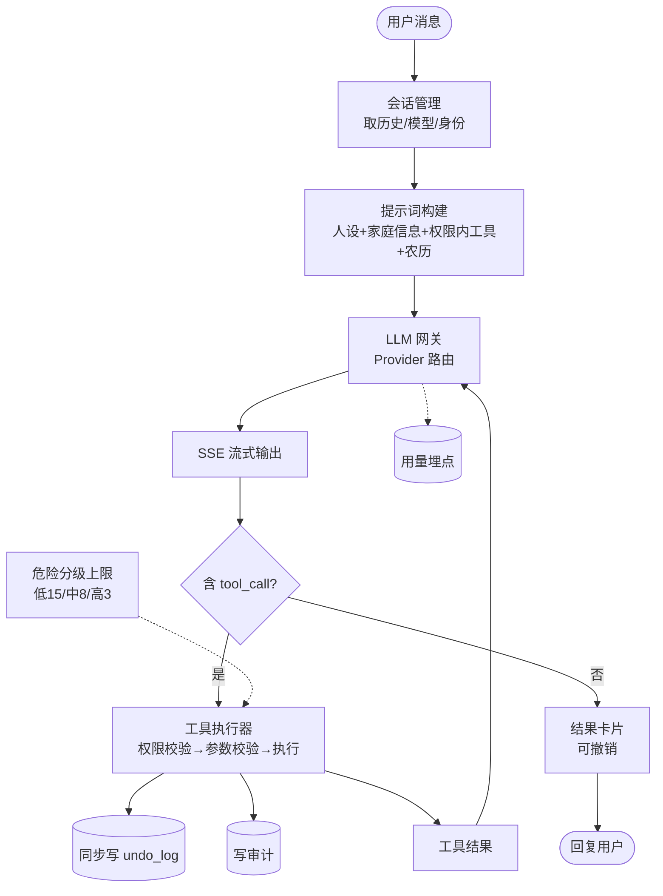

# Agent 调度器内部架构

> 对齐 **AI-STD-003（智能体架构标准）**。

```mermaid
flowchart TB
    Start([用户消息]) --> Sess[会话管理<br/>取历史/模型/身份]
    Sess --> Prompt[提示词构建<br/>人设+家庭信息+权限内工具+农历]
    Prompt --> GW[LLM 网关<br/>Provider 路由]
    GW --> Stream[SSE 流式输出]
    GW -.-> Usg[(用量埋点)]
    Stream --> Chk{含 tool_call?}
    Chk -->|是| Exec[工具执行器<br/>权限校验→参数校验→执行]
    Exec --> UndoW[(同步写 undo_log)]
    Exec --> AuditW[(写审计)]
    Exec --> Res[工具结果]
    Res --> GW
    Chk -->|否| Card[结果卡片<br/>可撤销]
    Card --> End([回复用户])
    Lim[危险分级上限<br/>低15/中8/高3] -.-> Exec
```
