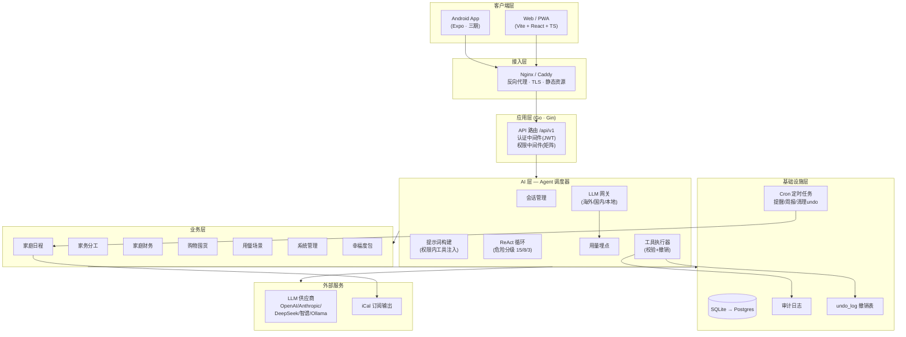

# 系统分层架构

七层架构，自上而下：客户端层 → 接入层 → 应用层 → AI 层 → 业务层 → 基础设施层 → 外部服务。

```mermaid
flowchart TB
    subgraph L1["客户端层"]
        Web["Web / PWA<br/>(Vite + React + TS)"]
        App["Android App<br/>(Expo · 三期)"]
    end
    subgraph L2["接入层"]
        Proxy["Nginx / Caddy<br/>反向代理 · TLS · 静态资源"]
    end
    subgraph L3["应用层 (Go · Gin)"]
        API["API 路由 /api/v1<br/>认证中间件(JWT)<br/>权限中间件(矩阵)"]
    end
    subgraph L4["AI 层 — Agent 调度器"]
        Sess["会话管理"]
        Prompt["提示词构建<br/>(权限内工具注入)"]
        GW["LLM 网关<br/>(海外/国内/本地)"]
        Loop["ReAct 循环<br/>(危险分级 15/8/3)"]
        Exec["工具执行器<br/>(校验+撤销)"]
        Usg["用量埋点"]
    end
    subgraph L5["业务层"]
        direction LR
        M1["家务分工"]
        M2["家庭日程"]
        M3["家庭财务"]
        M4["购物囤货"]
        M5["用餐场景"]
        M6["系统管理"]
        M7["幸福度包"]
    end
    subgraph L6["基础设施层"]
        DB[("SQLite → Postgres")]
        Cron["Cron 定时任务<br/>提醒/周报/清理undo"]
        Audit["审计日志"]
        Undo["undo_log 撤销表"]
    end
    subgraph L7["外部服务"]
        LLM["LLM 供应商<br/>OpenAI/Anthropic/<br/>DeepSeek/智谱/Ollama"]
        ICal["iCal 订阅输出"]
    end

    Web --> Proxy
    App --> Proxy
    Proxy --> API
    API --> L4
    L4 --> L7
    L4 --> L5
    L5 --> L6
    Cron --> M2
    Exec --> Undo
    Exec --> Audit
    GW --> Usg
    M2 --> ICal
```
