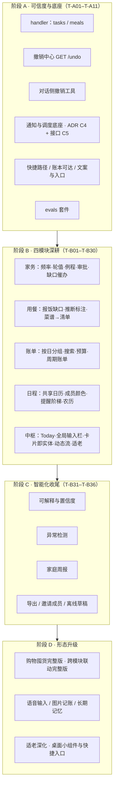

# 迭代边界（V1 四模块深耕 → 阶段 A–D）

> 对齐 **AI-STD-001 生命周期**（迭代边界与复杂度阶梯）。

> **2026-09-18 更新**：V1 由「一期 MVP 核心闭环」升为**四模块（家务/用餐/账单/日程）同权深耕**，边界以 [AI-PRD §10](../AI-PRD.md) 为准（§8 各模块 V1/V2/V3 已同步）。
> 阶段划分推导见 [product/product-design-research-01.md](../product/product-design-research-01.md) §15 与 [product/product-inspiration-01.md](../product/product-inspiration-01.md) §6；任务总览见 [exec-plans/README.md](../exec-plans/README.md)。
> 重新渲染（本机 chrome-headless-shell 未装，需指定已装 Chrome）：
> `PUPPETEER_EXECUTABLE_PATH="C:\Program Files\Google\Chrome\Application\chrome.exe" mmdc -i docs/ui/roadmap-iterations.md -o docs/ui/roadmap-iterations.png -b white`
> 注意：markdown 输入实际输出 `roadmap-iterations-1.png`，需改名覆盖为 `roadmap-iterations.png`。

## 出口判定

- **阶段 A**：「说了/点了，页面就变」+ 24h 内写操作一处可撤销 + 通知可静音/可回溯/不越权 + evals 全绿。
- **阶段 B**：四模块全部 **≥ L3**（分级见 AI-PRD §10.0）+ Today 五块可用 + 至少一条跨模块联动真实可用。

## 明确不做（全期不变）

外卖下单 / 电商比价 / AA 结算 / 投资理财 / 银行卡直连 / 多租户 SaaS / 位置共享 / 第三方日历双向同步 / 通用闲聊（来源：[AI-PRD §7](../AI-PRD.md)）。
