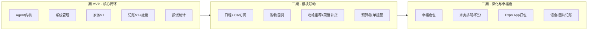

# 迭代边界（V1/V2/V3）

```mermaid
flowchart LR
    subgraph V1["一期 MVP · 核心闭环"]
        A1[Agent内核]
        A2[系统管理]
        A3[家务V1]
        A4[记账V1+撤销]
        A5[报饭统计]
    end
    subgraph V2["二期 · 模块联动"]
        B1[日程+iCal订阅]
        B2[购物囤货]
        B3[吃啥推荐+菜谱补货]
        B4[预算/账单提醒]
    end
    subgraph V3["三期 · 深化与幸福度"]
        C1[幸福度包]
        C2[家务排班/积分]
        C3[Expo App打包]
        C4[语音/图片记账]
    end
    V1 --> V2 --> V3
```
