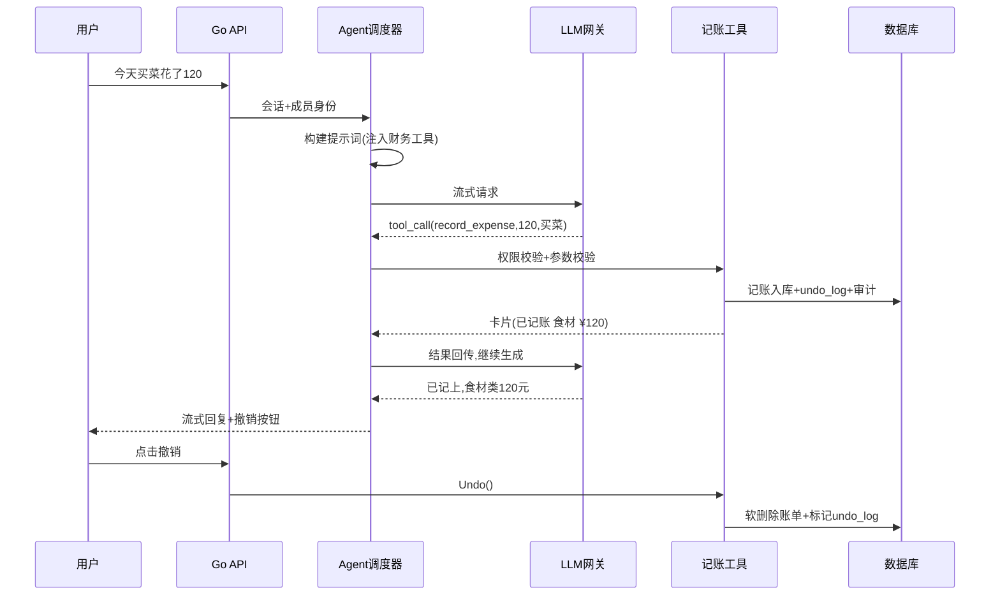

# 对话执行时序

示例："今天买菜花了 120"

```mermaid
sequenceDiagram
    participant U as 用户
    participant API as Go API
    participant A as Agent调度器
    participant L as LLM网关
    participant T as 记账工具
    participant DB as 数据库
    U->>API: 今天买菜花了120
    API->>A: 会话+成员身份
    A->>A: 构建提示词(注入财务工具)
    A->>L: 流式请求
    L-->>A: tool_call(record_expense,120,买菜)
    A->>T: 权限校验+参数校验
    T->>DB: 记账入库+undo_log+审计
    T-->>A: 卡片(已记账 食材 ¥120)
    A->>L: 结果回传,继续生成
    L-->>A: 已记上,食材类120元
    A-->>U: 流式回复+撤销按钮
    U->>API: 点击撤销
    API->>T: Undo()
    T->>DB: 软删除账单+标记undo_log
```
